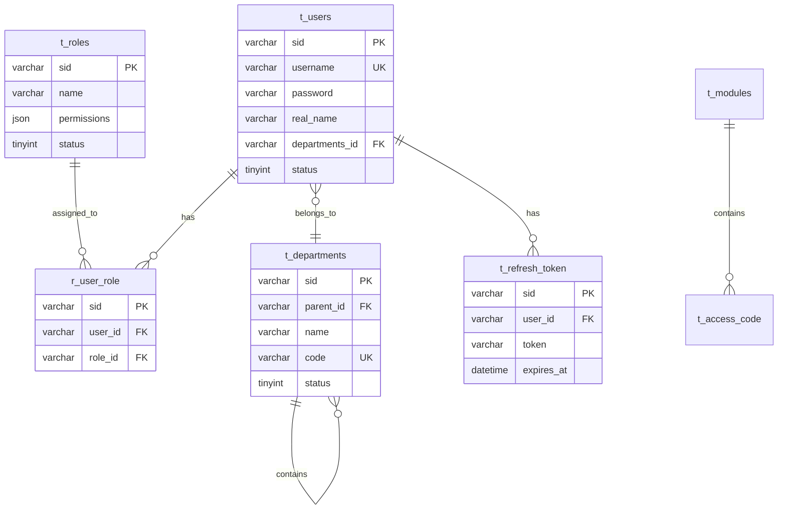
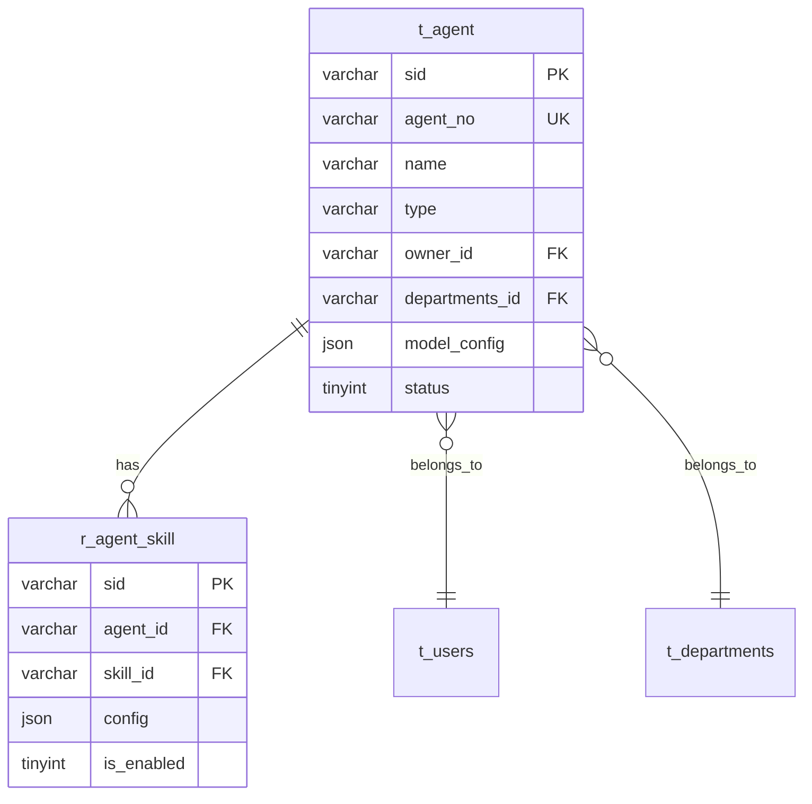

# Cradle 数据库设计文档

## 概述

本文档定义 Cradle 企业级 AI 助理平台的数据库结构，基于前端 UI 分析结果，设计支持系统管理、用户认证、Agent 核心和记忆系统的数据库 schema。

## 核心概念

### Message（消息）
**定义**：用户与 Agent 之间的业务交流内容

**说明**：
- 代表"谁说了什么"的业务层面概念
- 包括用户输入、Agent 回复、系统通知、技能调用等
- 存储在记忆系统中，支持历史检索和上下文恢复
- 对应记忆系统的 `t_short_term_memory` 表

### Context（上下文）
**定义**：Cradle 与 LLM 之间的交互协议数据

**说明**：
- 代表"模型看到什么"的 LLM 层面概念
- 按 LLM API 格式组织（system/users/assistant/tool 角色）
- 包含系统提示、对话历史、工具调用结果等
- 受 context window（上下文窗口）限制
- 对应 Core 模块的 `t_context` 表

### Session（会话）
**定义**：用户与 Agent 对话的容器和上下文管理单元

**说明**：
- 包含 Message 历史（业务层面）
- 维护 Context 窗口（LLM 层面）
- 管理会话状态、token 统计、压缩历史等
- 对应 `t_session` 表

### 三者关系

```
┌─────────────────────────────────────────────────────────────┐
│                         Session                              │
│  ┌──────────────────────────────────────────────────────┐  │
│  │  Message Layer (业务层)                               │  │
│  │  - 用户输入: "帮我查询销售数据"                        │  │
│  │  - Agent回复: "好的，请稍等..."                       │  │
│  │  - 存储: t_short_term_memory                         │  │
│  └──────────────────────────────────────────────────────┘  │
│                              ↓                               │
│  ┌──────────────────────────────────────────────────────┐  │
│  │  Context Layer (LLM层)                                │  │
│  │  - system: "你是一个销售助手..."                       │  │
│  │  - user: "帮我查询销售数据"                           │  │
│  │  - assistant: "好的，请稍等..."                       │  │
│  │  - 存储: t_context                                   │  │
│  └──────────────────────────────────────────────────────┘  │
│                              ↓                               │
│  ┌──────────────────────────────────────────────────────┐  │
│  │  LLM API Call                                         │  │
│  │  - 发送给 OpenAI/Claude 等模型                        │  │
│  └──────────────────────────────────────────────────────┘  │
└─────────────────────────────────────────────────────────────┘
```

**转换流程**：
1. 用户发送 **Message** → 存入 `t_short_term_memory`
2. Message 转换为 **Context** 格式 → 存入 `t_context`
3. Context 组装成 LLM API 请求 → 发送给模型
4. 模型返回响应 → 转为 Context → 转为 Message
5. Message 返回给用户

## 技术选型

- **数据库**: SQLite (MVP 阶段)
- **向量扩展**: sqlite-vec (用于记忆检索)
- **ORM**: 待定 (Prisma/TypeORM)
- **编码**: UTF-8

## 命名规范

- 表名: 使用 `t_` 前缀 + 业务名 (e.g., `t_users`, `t_codes`)
- 关系表: 使用 `r_` 前缀 + 关联表名 (e.g., `r_user_role`, `r_agent_skill`)
- 视图: 使用 `v_` 前缀 (e.g., `v_user_detail`)
- 存储过程: 使用 `p_` 前缀 (e.g., `p_get_users_list`)
- 字段名: 小写 + 下划线 (e.g., `create_time`, `parent_id`)
- 主键: `sid` VARCHAR(36) UUID
- 必须字段: `sid`, `name`, `description`, `create_time`, `deleted`, `timestamp`, `status`

> **注意**: 详细设计规范请参考 [DATABASE_SPECIFICATION.md](./DATABASE_SPECIFICATION.md)

## 模块结构

```
system_design/
├── DATABASE_SPECIFICATION.md  # 数据库设计规范
├── DESIGN_SPECIFICATION.md    # 设计文档规范
├── README.md                  # 本索引文件
├── organization/              # 组织管理模块
│   ├── README.md              # 模块索引
│   ├── roles.md                # 角色管理设计
│   └── database/              # 数据库设计
│       ├── t_users.md          # 用户管理表
│       ├── t_departments.md          # 部门管理表
│       ├── t_roles.md          # 角色管理表
│       ├── t_access_code.md   # 访问码/权限码表
│       ├── t_refresh_token.md # 刷新令牌表
│       └── r_user_roles.md     # 用户-角色关联表
├── core/                      # 核心基础模块
│   ├── README.md              # 模块索引
│   ├── context.md             # 上下文管理设计
│   └── llm-adapter.md         # 大模型对接设计
├── system/                    # 系统管理模块
│   ├── README.md              # 模块索引
│   ├── code_management.md     # 代码管理设计
│   ├── cli.md                 # CLI基础设施设计
│   └── database/              # 数据库设计
│       ├── t_codes.md          # 代码管理表
│       ├── t_modules.md        # 模块管理表
│       ├── t_exec_session.md  # 命令执行会话表
│       └── t_exec_approval.md # 执行审批记录表
├── cron/                      # 定时任务模块
│   ├── README.md              # 模块索引
│   ├── cron-cli.md            # Cron CLI设计
│   └── database/              # 数据库设计
│       ├── t_cron_job.md      # 定时任务表
│       └── t_cron_job_history.md # 定时任务历史表
├── workflow/                  # 工作流编排模块
│   ├── README.md              # 模块索引
│   └── workflow.md            # 工作流编排设计
├── agent/                     # Agent 核心模块
│   ├── README.md              # 模块索引
│   ├── runtime.md             # 运行时设计
│   └── database/              # 数据库设计
│       ├── t_agent.md         # Agent 定义表
│       └── r_agent_skill.md   # Agent-Skill 关联表
├── gateway/                   # 网关层模块
│   ├── README.md              # 模块索引
│   ├── routing.md             # 网关路由设计
│   └── five_profiles.md       # 五重画像记忆引擎
├── skills/                    # 技能层模块
│   ├── README.md              # 模块索引
│   └── skills.md              # 技能层设计
- [storage.md](./storage.md) - 数据存储层总体设计
├── memory/                    # 记忆系统模块
│   ├── README.md              # 模块索引
│   ├── four_layers.md         # 四层记忆系统设计
│   ├── five_profiles.md       # 五重画像引擎设计
│   └── database/              # 数据库设计
│       ├── t_conversation.md              # 会话主表
│       ├── t_conversation_message.md      # 会话消息表
│       ├── t_conversation_log_meta.md     # 对话日志索引表
│       ├── t_long_term_memory.md          # 长期记忆表
│       ├── t_memory_index.md              # 记忆索引表
│       ├── r_memory_topic.md              # 记忆-主题关联表
│       ├── t_enterprise_profile.md        # 企业画像表
│       ├── t_positions_profile.md          # 岗位画像表
│       ├── t_agent_fact.md                # Agent 事实表
│       ├── t_relationship.md              # Agent-Contact 双向关系表
│       └── t_contact_fact.md               # Contact 事实表
└── overall.md                 # 总体架构设计
```

## 数据表清单

### 组织管理模块 (organization)

| 表名 | 类型 | 说明 | 文档 |
|------|------|------|------|
| t_users | 数据表 | 用户管理表 | [查看](./organization/database/t_users.md) |
| t_departments | 数据表 | 部门管理表 | [查看](./organization/database/t_departments.md) |
| t_roles | 数据表 | 角色管理表 | [查看](./organization/database/t_roles.md) |
| t_access_code | 数据表 | 访问码/权限码表 | [查看](./organization/database/t_access_code.md) |
| t_refresh_token | 数据表 | 刷新令牌表 | [查看](./organization/database/t_refresh_token.md) |
| r_user_role | 关系表 | 用户-角色关联表 | [查看](./organization/database/r_user_roles.md) |

### 系统管理模块 (system)

| 表名 | 类型 | 说明 | 文档 |
|------|------|------|------|
| t_codes | 数据表 | 代码管理表 | [查看](./system/database/t_codes.md) |
| t_modules | 数据表 | 模块管理表 | [查看](./system/database/t_modules.md) |
| t_exec_session | 数据表 | 命令执行会话表 | [查看](./system/database/t_exec_session.md) |
| t_exec_approval | 数据表 | 执行审批记录表 | [查看](./system/database/t_exec_approval.md) |

### 定时任务模块 (cron)

| 表名 | 类型 | 说明 | 文档 |
|------|------|------|------|
| t_cron_job | 数据表 | 定时任务表 | [查看](./cron/database/t_cron_job.md) |
| t_cron_job_history | 数据表 | 定时任务历史表 | [查看](./cron/database/t_cron_job_history.md) |

### Agent 模块 (agent)

| 表名 | 类型 | 说明 | 文档 |
|------|------|------|------|
| t_agent | 数据表 | Agent 定义表 | [查看](./agents/database/t_agent.md) |
| r_agent_skill | 关系表 | Agent-Skill 关联表 | [查看](./agents/database/r_agent_skill.md) |

### Core 核心模块

| 表名 | 类型 | 说明 | 文档 |
|------|------|------|------|
| t_model_provider | 数据表 | 模型提供商配置表 | [查看](./core/database/t_model_provider.md) |
| t_model_definition | 数据表 | 模型定义表 | [查看](./core/database/t_model_definition.md) |
| t_model_auth | 数据表 | 模型认证配置表 | [查看](./core/database/t_model_auth.md) |

### 记忆系统模块 (memory)

#### 对话日志层 (文件存储，按年分层)

**存储方案**: [对话日志存储设计](./memory/conversation_storage.md)

**核心原则**：文件创建时直接根据年份放入对应目录，位置永不改变。

| 存储类型 | 说明 | 路径 |
|---------|------|------|
| 日志文件 | 根据时间年份直接写入 | `workspace/{agent_id}/{user_id}/conversation/{year}/YYYY-MM-DD.log` |
| 压缩日志 | 超过30天自动压缩 | `workspace/{agent_id}/{user_id}/conversation/{year}/YYYY-MM-DD.log.gz` |
| 归档文件 | 超过3年整年打包 | `workspace/{agent_id}/{user_id}/conversation/archive/{year}_all.tar.gz` |
| 年度索引 | 每年独立索引 | `workspace/{agent_id}/{user_id}/conversation/{year}/index.db` |
| 会话元数据 | 数据表 | [t_conversation](./memory/database/t_conversation.md) |

#### 长期记忆层

| 表名 | 类型 | 说明 | 文档 |
|------|------|------|------|
| t_long_term_memory | 数据表 | 长期记忆表 | [查看](./memory/database/t_long_term_memory.md) |

#### 记忆索引层

| 表名 | 类型 | 说明 | 文档 |
|------|------|------|------|
| t_memory_index | 数据表 | 记忆索引表 | [查看](./memory/database/t_memory_index.md) |
| r_memory_topic | 关系表 | 记忆-主题关联表 | [查看](./memory/database/r_memory_topic.md) |

#### 五重画像层

| 表名 | 类型 | 说明 | 文档 |
|------|------|------|------|
| t_enterprise_profile | 数据表 | 企业画像表 | [查看](./memory/database/t_enterprise_profile.md) |
| t_positions_profile | 数据表 | 岗位画像表 | [查看](./memory/database/t_positions_profile.md) |
| t_agent_fact | 数据表 | Agent 事实表 | [查看](./memory/database/t_agent_fact.md) |
| t_relationship | 数据表 | Agent-Contact 双向关系表 | [查看](./memory/database/t_relationship.md) |
| t_contact_fact | 数据表 | Contact 事实表 | [查看](./memory/database/t_contact_fact.md) |

## ER 图

### 组织管理模块



### Agent 模块



## 关联文档

- [设计文档规范](./DESIGN_SPECIFICATION.md)
- [数据库设计规范](./DATABASE_SPECIFICATION.md)
- [总体架构设计](./overall.md)
